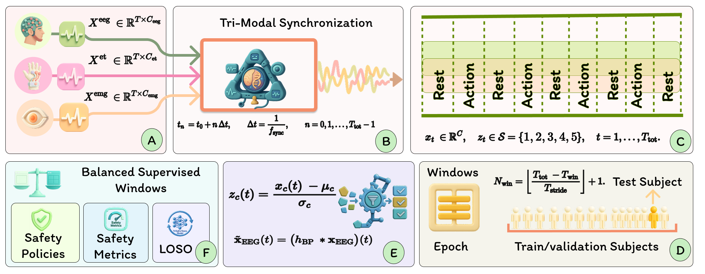
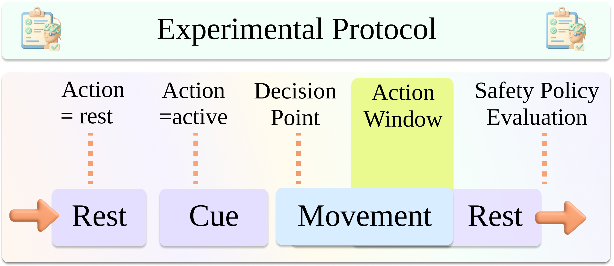
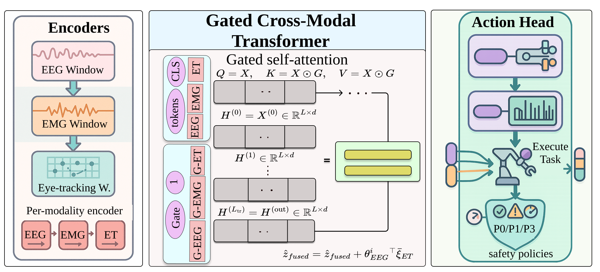

# SafeIntentDetectionPaperDec2025
Companion repository for the paper with code, dataset resources, and Wiki documentation.
# Safety-Aware Multimodal Intent Recognition with EEG, EMG, and Eye Tracking for Assistive Robotics (TriSaFe-Trans)  
## + Real Robot Execution on Kinova Gen3 (ROS 2 + Robotiq 2F-85)

This repository contains the **BioRob 2025 code release** for **TriSaFe-Trans**, a **safety-aware tri-modal intent recognition** framework that fuses **EEG + EMG + Eye Tracking** and evaluates performance **at the policy level** using safety metrics (**SAE/UAR/MIR/NRA**) under **robustness scenarios (S0–S3)** and **policies (P0–P2)**.

It also includes a **real-robot implementation** on a **Kinova Gen3 (6-DoF) + Robotiq 2F-85** using **ROS 2**, where inferred tasks trigger **autonomous execution** of pre-recorded joint waypoint routines.

> **Status:** Code release for reproducibility. **Dataset will be made available later** (see [Data availability](#data-availability)).

---

## Table of contents
- [Highlights](#highlights)
- [Figures](#figures)
- [Repository layout](#repository-layout)
- [Environment setup](#environment-setup)
- [Data availability](#data-availability)
- [ML pipeline (Phase 1–6)](#ml-pipeline-phase-16)
- [Real robot implementation (ROS 2 + Kinova Gen3)](#real-robot-implementation-ros-2--kinova-gen3)
  - [System flow (end-to-end)](#system-flow-end-to-end)
  - [How motion was recorded (teleoperation → waypoint library)](#how-motion-was-recorded-teleoperation--waypoint-library)
  - [Robot execution package (pre-recorded tasks)](#robot-execution-package-pre-recorded-tasks)
  - [Build and bring-up](#build-and-bring-up)
  - [Run tasks](#run-tasks)
    - [Run a task manually](#a-run-a-task-manually-sanity-check)
    - [Run a task from human sensor data (TriSaFe-driven)](#b-run-a-task-from-human-sensor-data-trisafe-driven-execution)
- [Safety notice](#safety-notice)
- [Citation](#citation)
- [License](#license)

---

## Highlights

### What this repo provides (ML pipeline: Phase 1–6)
- **Tri-modal synchronization** (EEG/EMG/ET) using a master clock and bounded lag estimation.
- **REST vs ACTION + task labeling** using an HSMM-like single-segment decoder + safety-style REST shields.
- **Manifest + true LOSO splits** (leave-one-subject-out), windowing (**2.0s @ 250 Hz**, stride 0.25 s).
- **Deterministic preprocessing + caching** (Phase 4) for reproducibility.
- **LOSO NPZ export** for supervised balanced training + SSL unbalanced pretraining exports (Phase 5).
- **Optional feature extraction** (Phase 5.5): EEG PSD features + richer EMG TD features.
- **Phase 6 trainer:** SSL → supervised LOSO fine-tuning, tri-modal gated fusion, robustness S0–S3, policies P0–P2, classic + safety metrics.

### What this repo provides (Real robot: ROS 2 + Kinova Gen3)
- Executes **pre-recorded joint waypoint tasks** on Kinova Gen3 + Robotiq 2F-85.
- Sends:
  - `FollowJointTrajectory` → `/joint_trajectory_controller/follow_joint_trajectory`
  - `GripperCommand` → `/robotiq_gripper_controller/gripper_cmd`
- Includes a runner that:
  - reads human sensor data (EEG/EMG/ET),
  - performs inference,
  - outputs a **task number**,
  - triggers the corresponding **autonomous joint-trajectory replay**.

---

## Figures

### Pipeline overview (Phase 1–6)


### System overview


### Experimental protocol and labeling timeline


### TriSaFe-Trans architecture


---

## Repository layout

Common paths you will see:
- `figures/` — paper figures used in README
- `kinova_joint_data/` — recorded joint waypoint tasks (one folder per task)
- `src/moveit_joint_sender_py/` — ROS 2 Python package for sending trajectories / executing tasks
- `LICENSE`, `.gitignore`, `README.md`

> Note: The ML pipeline (Phase 1–6), training, and inference scripts may be organized in additional folders in your release (e.g., `pipeline/`, `scripts/`, or `icml/`). This README documents the **full method** and provides **fully runnable ROS 2 robot commands**.

---

## Environment setup

### Python (ML + inference)
Recommended:
- Python **3.10+**
- Ubuntu 20.04/22.04 recommended
- GPU optional (training benefits from CUDA)

Minimal setup:
```bash
python -m venv .venv
source .venv/bin/activate
pip install -U pip

# Minimal common deps (expand as needed for your pipeline)
pip install numpy pandas scipy scikit-learn matplotlib tqdm jupyter
pip install torch  # if your Phase-6 trainer uses PyTorch
