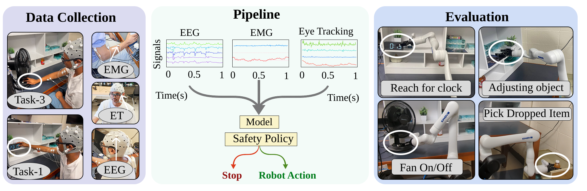
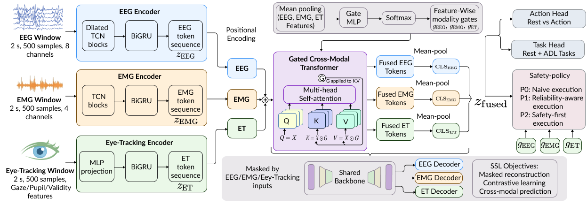

# SafeIntentDetectionPaper

**Companion repository** for the paper:

**TriSaFe-Trans: A Safety-Aware Multimodal Intent Recognition Pipeline for Assistive Robotics**

This repository contains the code for multimodal intent recognition using **EEG, EMG, and eye-tracking** signals, together with a ROS 2 implementation for executing assistive manipulation tasks on a **Kinova Gen3 robot arm with a Robotiq gripper**.

> **Status:** Code release for reproducibility. The public dataset will be released after privacy/anonymization checks.

---

## Repository Contents

This repository includes three main components:

1. **Full notebook pipeline** for data cleaning, synchronization, labeling, preprocessing, LOSO export, feature extraction, model training, and safety-aware evaluation.
2. **Implementation folder** with an all-subject Phase 6 run and trained-model download notes.
3. **Robot execution code** for Kinova Gen3 + Robotiq task execution using ROS 2 and pre-recorded joint waypoint trajectories.

---

## Repository Layout

```text
SafeIntentDetectionPaper/
├── Figures/
│   ├── Data_collection.png
│   ├── Model-Arch.png
│   ├── Overview.png
│   └── TriSaFe-Transpipeline.png
│
├── Implementation/
│   ├── Download_train_Model.text
│   └── Phase-6(All-Sub).ipynb
│
├── Notebooks/
│   ├── Phase1A.ipynb
│   ├── Phase1B.ipynb
│   ├── Phase1C.ipynb
│   ├── Phase2A_HSMM.ipynb
│   ├── Phase2B.ipynb
│   ├── Phase3_Manifest.ipynb
│   ├── Phase4_Preprocessing.ipynb
│   ├── Phase5_LOSO.ipynb
│   ├── Phase5_5_Feature_Extraction.ipynb
│   ├── BioRob_Phase6_Main.ipynb
│   └── README.md
│
├── kinova-joint-tasks-main/
│   ├── kinova_joint_data/
│   ├── src/
│   ├── test/
│   ├── .gitignore
│   ├── LICENSE
│   └── README.md
│
├── License
├── README.md
└── index.html
```

---

## Important Note About File Paths

Before running any notebook, users must update the file paths according to their own data location.

Most notebooks contain path variables such as:

```python
ROOT_DIR = Path("/path/to/your/data/folder")
DATASET_DIR = ROOT_DIR / "_dataset_icml_v1"
```

Change these paths before running the notebooks. For example:

```python
ROOT_DIR = Path("/home/username/SafeIntentDetectionPaper/data")
```

or on Windows:

```python
ROOT_DIR = Path(r"C:\Users\username\SafeIntentDetectionPaper\data")
```

Do **not** run the notebooks with the original author’s local paths unless your folder structure is identical.

---

## Quick Start

### Option A — Full Reproducibility Pipeline

Run the notebooks inside the `Notebooks/` folder in this order:

```text
1. Phase1A.ipynb
2. Phase1B.ipynb
3. Phase1C.ipynb
4. Phase2A_HSMM.ipynb
5. Phase2B.ipynb
6. Phase3_Manifest.ipynb
7. Phase4_Preprocessing.ipynb
8. Phase5_LOSO.ipynb
9. Phase5_5_Feature_Extraction.ipynb
10. BioRob_Phase6_Main.ipynb
```

Each phase depends on files generated by the previous phase.

### Option B — Model/Implementation Run

Use the `Implementation/` folder for a simplified run or all-subject model workflow:

```text
Implementation/Phase-6(All-Sub).ipynb
Implementation/Download_train_Model.text
```

### Option C — Robot Execution

Use the `kinova-joint-tasks-main/` folder for ROS 2 robot execution with Kinova Gen3 and Robotiq gripper waypoint tasks.

---

## Full Notebook Pipeline Summary

### Phase 1A — Metadata Cleaning and Raw CSV Preparation

**Notebook:** `Notebooks/Phase1A.ipynb`

Cleans the original raw CSV files, removes unnecessary metadata, extracts subject/task/trial information, standardizes timestamps, and prepares cleaned per-trial CSV files.

**Main output:**

```text
Sub-*/cleaned/*.csv
```

**Privacy note:**  
This phase may be skipped if the released dataset is already anonymized and cleaned.

---

### Phase 1B — Schema Verification and Column Standardization

**Notebook:** `Notebooks/Phase1B.ipynb`

Scans cleaned subject folders, checks required EEG/EMG/eye-tracking columns, removes unsupported columns, adds missing expected columns when allowed, and writes schema reports.

**Main outputs:**

```text
train_schema.json
trainschema_prune_report.csv
Sub-*/cleaned/*.csv
```

---

### Phase 1C — Tri-Modal Temporal Synchronization

**Notebook:** `Notebooks/Phase1C.ipynb`

Synchronizes EEG, EMG, and eye-tracking streams using timestamps and resamples them onto a common fixed-rate grid.

**Main outputs:**

```text
Sub-*/cleaned/synchronized_proper_lite_union_v3/*_synchronized_corrected.csv
synchronization_summary.csv
```

---

### Phase 2A — HSMM-Based Action/Rest Labeling

**Notebook:** `Notebooks/Phase2A_HSMM.ipynb`

Generates weak action/rest labels using an HSMM-style segmentation pipeline from synchronized EEG, EMG, and eye-tracking signals.

**Main outputs:**

```text
Sub-*/cleaned/synchronized_proper_lite_union_v3/label/*_icml_consensus_labels.csv
Sub-*/cleaned/synchronized_proper_lite_union_v3/label/*_onsets.json
icml_consensus_batch_summary.csv
```

**Important:**  
Eye-tracking validity coding should be verified before rerunning this phase on new data. In the cleaned/synchronized files used in this project, eye validity is treated as:

```text
1 = valid / usable
0 = invalid / not worn / unusable
```

---

### Phase 2B — Label-Only Export and Column Guard

**Notebook:** `Notebooks/Phase2B.ipynb`

Validates labeled CSV files and exports compact label-only files required by later phases.

**Main outputs:**

```text
Sub-*/cleaned/synchronized_proper_lite_union_v3/labelonly/*_icml_consensus_labels.csv
column_invalid_or_skipped.csv
active_zero_rows_removed.csv
```

---

### Phase 3 — Manifest Creation and TRUE LOSO Splits

**Notebook:** `Notebooks/Phase3_Manifest.ipynb`

Creates the dataset manifest and subject-independent leave-one-subject-out (LOSO) train/validation/test splits.

**Main outputs:**

```text
_dataset_icml_v1/manifest_v1.csv
_dataset_icml_v1/splits_v1.csv
_dataset_icml_v1/dataset_analysis_report.txt
```

---

### Phase 4 — Deterministic Signal Preprocessing

**Notebook:** `Notebooks/Phase4_Preprocessing.ipynb`

Applies deterministic preprocessing to EEG, EMG, and eye-tracking signals.

- EEG: band-pass filtering, optional notch filtering, common average referencing, artifact repair.
- EMG: high-pass filtering, rectification, envelope extraction.
- Eye tracking: validity/blink handling, interpolation, smoothing, feature-mask generation.

**Main outputs:**

```text
*.preproc.npz
*.preproc_log.json
_dataset_icml_v1/qc_summary_v1.csv
_dataset_icml_v1/qc_summary_by_subject_v1.csv
```

**Signal-shape convention:**

```text
EEG: time × channels
EMG: time × channels
ET : time × features
```

Filtering should be applied along the time axis.

---

### Phase 5 — LOSO Exporter

**Notebook:** `Notebooks/Phase5_LOSO.ipynb`

Converts Phase 4 preprocessed caches into fold-wise training, validation, and test `.npz` shards. It computes train-only normalization statistics and exports fixed-length windows.

**Main outputs:**

```text
_dataset_icml_v1/exports_v1_balanced_fold*/
_dataset_icml_v1/exports_v1_ssl_fold*/
```

**Notes:**

- Balanced exports are used for supervised fine-tuning.
- SSL exports are used for self-supervised pretraining.
- Signal masks are used internally for coverage filtering and train-only normalization.
- Final Phase 5 shards contain normalized model inputs and labels.

---

### Phase 5.5 — EEG/EMG Feature Extraction

**Notebook:** `Notebooks/Phase5_5_Feature_Extraction.ipynb`

Extracts engineered EEG and EMG features from Phase 5 supervised exports.

**Main output:**

```text
_dataset_icml_v1/features_v1_eeg_psd_full_fold{fold}_{split}.npz
```

Examples of extracted features include EEG PSD/bandpower/Hjorth descriptors and EMG RMS/MAV/waveform-length features.

---

### Phase 6 — SSL Pretraining, Supervised Fine-Tuning, and Safety Evaluation

**Notebook:** `Notebooks/BioRob_Phase6_Main.ipynb`

Trains and evaluates the TriSaFe-Trans model. The workflow includes fold-specific SSL pretraining, supervised LOSO fine-tuning, nominal evaluation, ablations, modality-dropout robustness tests, and safety-policy evaluation.

**Main outputs:**

```text
model checkpoints
fold-level evaluation files
summary metrics
safety-policy results
robustness results
```

**Sensor scenarios:**

```text
S0 = all sensors available
S1 = EEG dropped
S2 = EMG dropped
S3 = eye-tracking dropped
```

**Safety policies:**

```text
P0 = raw action probability
P1 = gate-/availability-based reliability proxy
P2 = reliability proxy plus uncertainty penalty
```

---

## Model Inputs

The Phase 6 model expects the following arrays from Phase 5 shards:

```text
X_EEG
X_EMG
X_ET
y_action
y_task
```

The current Phase 6 model does **not** require direct mask-array inputs such as:

```text
M_EEG
M_EMG
M_ET
ET_valid
```

Signal-quality masks are used during preprocessing/export for coverage filtering and normalization, but they are not direct neural-network inputs in the current implementation.

---

## Figures

Figures used in the paper and repository are available in the `Figures/` folder.

Example:

```markdown


```

---

## Real Robot Implementation

The `kinova-joint-tasks-main/` folder contains ROS 2 code for executing assistive manipulation tasks with a Kinova Gen3 robot arm and Robotiq gripper.

The robot implementation uses pre-recorded joint waypoint trajectories. During operation, the predicted task ID can be mapped to a stored trajectory, allowing the robot to execute the corresponding assistive action.

For setup and robot-specific instructions, see:

```text
kinova-joint-tasks-main/README.md
```

---

## Environment Setup

### Recommended

- Python 3.10+
- Jupyter Notebook or JupyterLab
- NumPy, Pandas, SciPy, scikit-learn, Matplotlib
- PyTorch for Phase 6 training
- CUDA-capable GPU recommended for model training

### Basic Python environment

```bash
python -m venv .venv
source .venv/bin/activate

pip install -U pip
pip install numpy pandas scipy scikit-learn matplotlib tqdm jupyter
pip install torch
```

For ROS 2 and Kinova execution, follow the setup instructions inside `kinova-joint-tasks-main/`.

---

## Data Availability

The raw data may contain participant-related metadata. To protect participant privacy, the public dataset should be released only after removing personal or identifiable metadata.

If users start from already cleaned/anonymized files, they may skip Phase 1A and begin from Phase 1B or the earliest phase matching the released dataset structure.

---

## Reproducibility and Safety Checks

Before reporting results, verify the following:

- The root data paths are updated correctly for your local machine.
- EEG/EMG/ET arrays follow the `time × channels/features` convention.
- Filtering is applied along the time axis.
- Train/validation/test splits are subject-independent.
- Normalization statistics are computed from training data only.
- Validation data is used for threshold/model selection; test data is not used for tuning.
- Eye-tracking validity coding is consistent across phases.
- Final subject/file/window counts are reported from `manifest_v1.csv` and `splits_v1.csv`.
- Phase 5 shards match the Phase 6 model input requirements.

---

## Citation

If you use this code or dataset, please cite the related paper:

```bibtex
@inproceedings{I will update,
  title     = {TriSaFe-Trans: A Safety-Aware Multimodal Intent Recognition Pipeline for Assistive Robotics},
  author    = {Sultan, Tipu and Cool, Kody and Liu, Guangping and Tamilselvan, Gajapriya and Babaiasl, Madi},
  booktitle = {Proceedings of the IEEE RAS/EMBS International Conference on Biomedical Robotics and Biomechatronics},
  year      = {2026}
}
```

---

## License

See the repository `License` file for usage terms.

---

## Contact

For questions, please open an issue in this repository or contact the corresponding authors listed in the paper.
